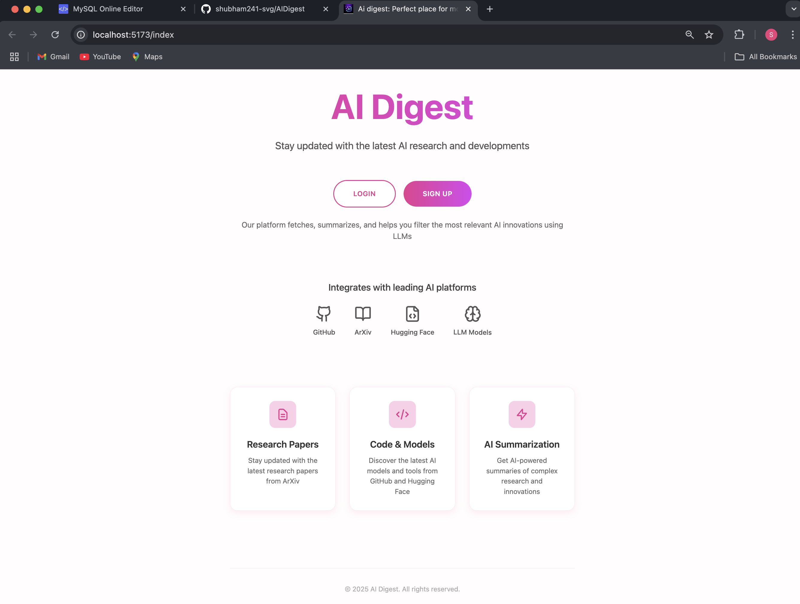
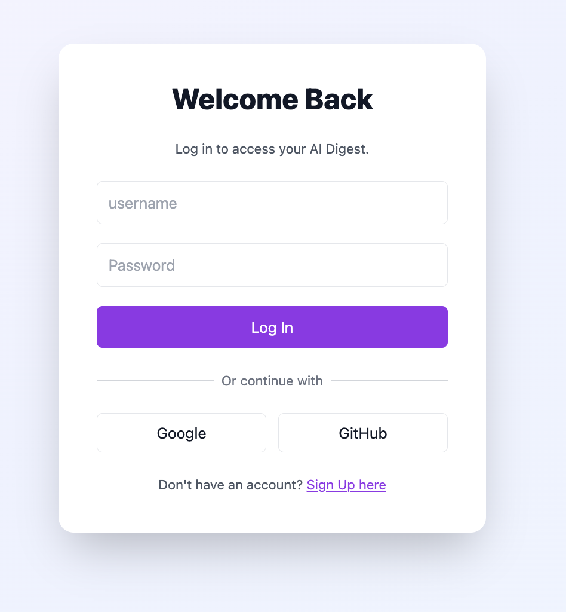
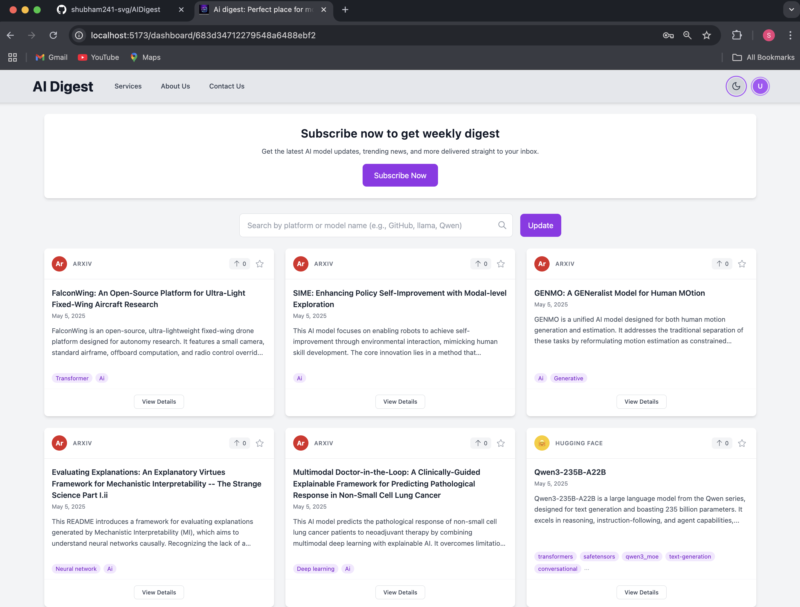
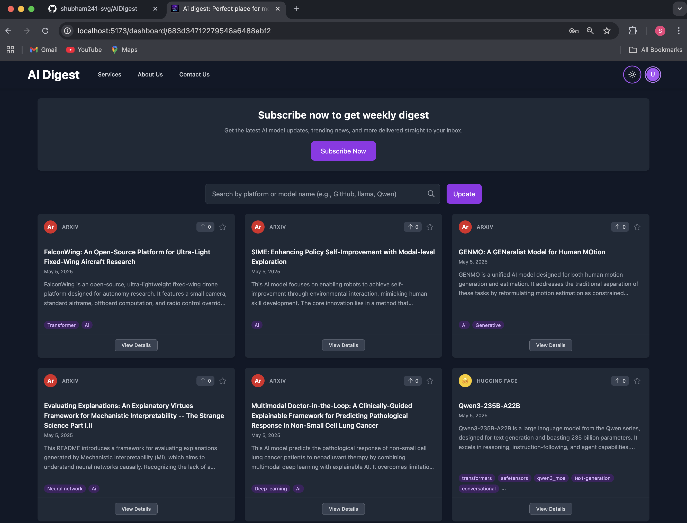
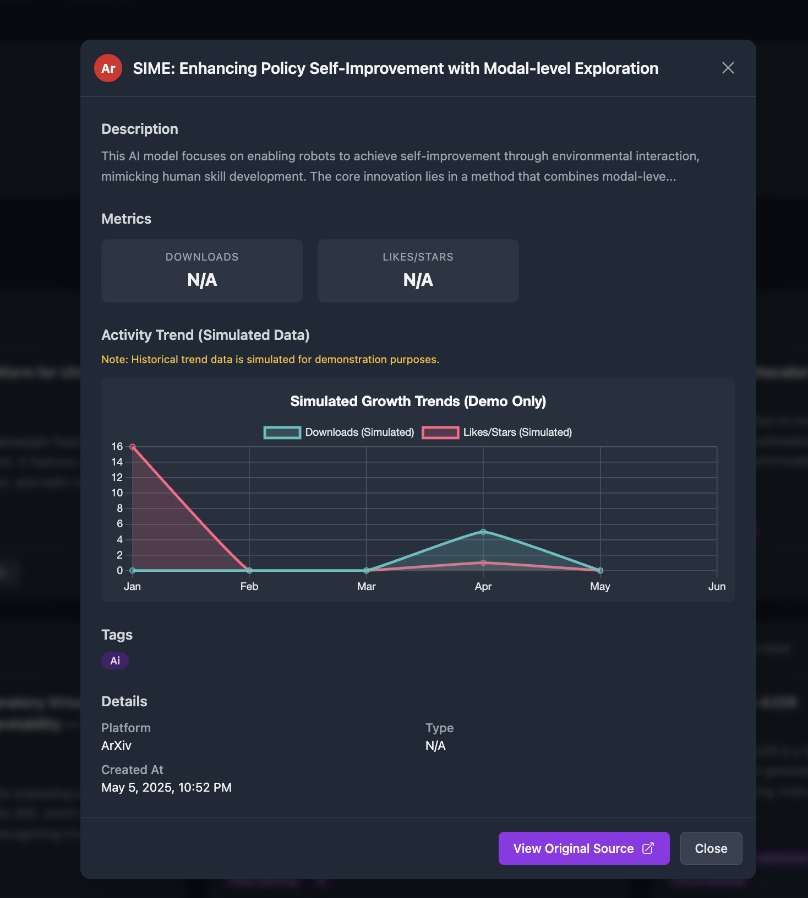

# 🤖 AI Digest

**Stay updated with the latest AI research and developments**

AI Digest is a comprehensive platform that fetches, summarizes, and helps you filter the most relevant AI innovations using LLMs. Our platform integrates with leading AI platforms to bring you the latest research papers, models, and tools in one centralized location.

## 🌟 Features

- **📚 Research Papers**: Stay updated with the latest research papers from ArXiv
- **💻 Code & Models**: Discover the latest AI models and tools from GitHub and Hugging Face
- **⚡ AI Summarization**: Get AI-powered summaries of complex research and innovations
- **🔍 Smart Search**: Search by platform or model name (e.g., GitHub, llama, Qwen)
- **📊 Analytics Dashboard**: Track trending models and research with detailed metrics
- **🔔 Weekly Digest**: Subscribe to get weekly updates delivered to your inbox
- **🌓 Dark/Light Mode**: Toggle between themes for comfortable viewing

## 🚀 Platform Integrations

<div align="center">

| Platform | Description |
|----------|-------------|
| 🔬 **ArXiv** | Latest AI research papers and publications |
| 🐙 **GitHub** | Open-source AI projects and repositories |
| 🤗 **Hugging Face** | Pre-trained models and datasets |
| 🧠 **LLM Models** | Various language models and AI tools |

</div>

## 📱 Screenshots

### Landing Page
*Clean and intuitive interface with easy navigation*



### Authentication
*Secure login with multiple OAuth options*



### Dashboard - Light Mode
*Browse and discover AI models and research papers*



### Dashboard - Dark Mode
*Dark theme for comfortable viewing*



### Model Details
*Detailed view with metrics and activity trends*



## 🏗️ Project Structure

```
ai-digest/
├── back/                      # Backend server
│   ├── config/
│   │   └── db.js             # Database configuration
│   ├── controllers/          # API controllers
│   │   ├── arxivController.js
│   │   ├── authController.js
│   │   ├── githubController.js
│   │   └── huggingfaceController.js
│   ├── middleware/
│   │   └── auth.js           # Authentication middleware
│   ├── models/               # Data models
│   │   ├── modeldata.js
│   │   └── usermodel.js
│   ├── routes/               # API routes
│   ├── services/             # External service integrations
│   └── server.js             # Main server file
├── src/                      # Frontend source
│   ├── assets/
│   ├── components/
│   ├── contexts/
│   ├── data/
│   │   └── dummy_data.json   # Sample data
│   ├── pages/
│   ├── App.css
│   ├── App.jsx
│   ├── index.css
│   └── main.jsx
├── public/
├── package.json
├── tailwind.config.js
├── vite.config.js
└── README.md
```

## 🛠️ Tech Stack

### Frontend
- **React** - Modern UI library
- **Vite** - Fast build tool
- **Tailwind CSS** - Utility-first CSS framework
- **JavaScript/JSX** - Programming language

### Backend
- **Node.js** - Runtime environment
- **Express.js** - Web framework
- **MongoDB** - Database (inferred from structure)
- **JWT** - Authentication

### External APIs
- ArXiv API
- GitHub API
- Hugging Face API

## 🚀 Getting Started

### Prerequisites
- Node.js (v14 or higher)
- npm or yarn
- MongoDB

### Installation

1. **Clone the repository**
   ```bash
   git clone https://github.com/yourusername/ai-digest.git
   cd ai-digest
   ```

2. **Install frontend dependencies**
   ```bash
   npm install
   ```

3. **Install backend dependencies**
   ```bash
   cd back
   npm install
   ```

4. **Set up environment variables**
   ```bash
   # Create .env file in the back directory
   cp .env.example .env
   # Add your API keys and database URL
   ```

5. **Start the development servers**
   
   Backend:
   ```bash
   cd back
   npm run dev
   ```
   
   Frontend:
   ```bash
   npm run dev
   ```

6. **Open your browser**
   ```
   http://localhost:5173
   ```

## 🔧 Configuration

### Environment Variables

Create a `.env` file in the `back` directory:

```env
# Database
MONGODB_URI=your_mongodb_connection_string

# API Keys
GITHUB_TOKEN=your_github_token
HUGGINGFACE_TOKEN=your_huggingface_token

# JWT
JWT_SECRET=your_jwt_secret

# OAuth
GOOGLE_CLIENT_ID=your_google_client_id
GOOGLE_CLIENT_SECRET=your_google_client_secret
GITHUB_CLIENT_ID=your_github_oauth_client_id
GITHUB_CLIENT_SECRET=your_github_oauth_client_secret
```

## 📈 Features in Detail

### 🔍 Smart Search
- Search across multiple platforms simultaneously
- Filter by model type, platform, or keywords
- Real-time search suggestions

### 📊 Analytics
- Track model popularity and download trends
- Historical data visualization
- Simulated growth metrics for demonstration

### 🔔 Newsletter
- Weekly digest of trending AI developments
- Personalized content based on your interests
- Email notifications for important updates

### 🎨 User Interface
- Responsive design for all devices
- Dark/Light mode toggle
- Clean, modern interface
- Intuitive navigation

## 🤝 Contributing

We welcome contributions! Please see our [Contributing Guidelines](CONTRIBUTING.md) for details.

1. Fork the repository
2. Create your feature branch (`git checkout -b feature/AmazingFeature`)
3. Commit your changes (`git commit -m 'Add some AmazingFeature'`)
4. Push to the branch (`git push origin feature/AmazingFeature`)
5. Open a Pull Request

## 📝 License

This project is licensed under the MIT License - see the [LICENSE](LICENSE) file for details.

## 🙏 Acknowledgments

- ArXiv for providing access to research papers
- Hugging Face for their amazing model hub
- GitHub for hosting open-source AI projects
- All the researchers and developers in the AI community

## 📞 Contact

- **Project Link**: [https://github.com/yourusername/ai-digest](https://github.com/yourusername/ai-digest)
- **Email**: your.email@example.com
- **Twitter**: [@yourusername](https://twitter.com/yourusername)

---

<div align="center">

**⭐ Star this repository if you find it helpful!**

Made with ❤️ by the AI Digest Team

</div>